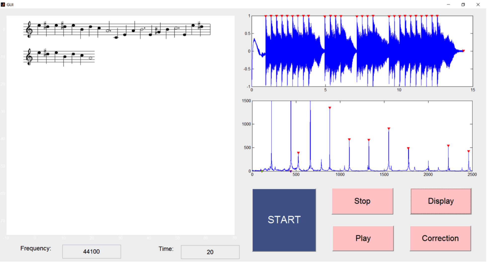

# music-to-note-convertor
A matlab software that convert music to music notes. 
The software can convert music into music sheet and detect any mistakes in the music compared to the original music sheet. This software is helpful to music composers and music learner.

 - Author: Team FORWARD
 - Instructor: Prof. Yanfeng Shen
 - Course: VG100 Intro to Engineering
 - Date: Aug 2016
## Team Member
 - Linyi Jin ([@jinlinyi](https://github.com/jinlinyi))
 - Xiuneng LU ([@lUxIUNENG](https://github.com/LuXiuneng))
 - Cunzhi Gao ([@cunzhig](https://github.com/cunzhig))
 - Shijie Zhou
 - Shiyue Gao
## Demo
The image is the GUI of the software. The top right part is a visualize of the data being processed. The left part is the output music sheet. 


A demo video is available on YouTube.

[](https://www.youtube.com/watch?v=ZouT3KRDMXM)

## Run
```
GUI.m
```
